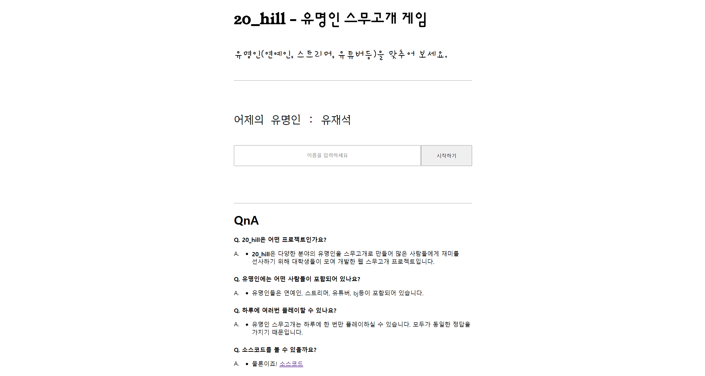

# 웹 스무고개 게임 / Web 20 Questions Game

**웹 스무고개 게임**은 사용자가 서버가 설정한 단어를 제한된 질문으로 추측하는 웹 기반 게임입니다.  
**Web 20 Questions Game** is a web-based game where users try to guess a word set by the server using a limited number of questions.

 **기술 스택 / Tech Stack**

- **백엔드 / Backend**: Spring Boot, Java
- **프론트엔드 / Frontend**: HTML, CSS, JavaScript
- **데이터베이스 / Database**: MySQL

---

## 🎯 프로젝트 개요 / Project Overview

**목적**: 스무고개 게임을 웹 상에서 구현하여 사용자가 간단하고 재미있게 즐길 수 있도록 제공합니다.  
**Purpose**: To implement the "20 Questions" game on the web, offering users a simple and enjoyable experience.

**주요 특징 / Key Features**:
- 서버가 매일 **한국의 유명인**을 단어로 설정  
  The server sets a **Korean celebrity** as the word daily
- 질문 목록은 80가지의 질문 중 매번 섞여서 표시되어 반복적인 패턴을 방지  
  The question list is shuffled each time from a pool of 80 questions to prevent repetitive patterns
- 질문에 대한 서버 응답을 실시간으로 화면에 표시.  
  The server's responses to the questions are displayed in real-time on the screen as "Yes" or "No"

---

## 🛠️ 실행 방법 / How to Run

1. **프로젝트 실행 / Start the Project**:
   - Spring Boot 메인 애플리케이션 클래스인 `Project20HillApplication`을 실행합니다.  
     Run the Spring Boot main application class: `Project20HillApplication`.

2. **로컬 접속 / Access Locally**:
   - 현재 웹 배포는 이루어지지 않으므로, 브라우저에서 아래 URL에 접속합니다:  
     Since the web deployment is not currently available, access the application in your browser using the following URL:
     ```plaintext
     http://localhost:8080
     ```
---

## 🚀 주요 기능 / Main Features

### 게임 기능 / Game Features
 - 사용자 이름을 입력하면 시작
   Start the game by entering the user's name.

 - 4가지 질문 중 하나를 선택하는 인터페이스
   Interface to select one of four questions.

 - 질문 목록 셔플링 기능
   Question list shuffling feature: The question list is shuffled to avoid repetition.

 - 질문에 대한 서버 응답을 네 / 아니오로 표시
   Display server responses: The server responds to questions with "Yes" or "No."

 - 20번의 질문 선택의 기회가 주어지고, 20번 내에 정답을 맞추지 못할 시 게임 오버
   Players are given 20 opportunities to select questions, and failing to guess the correct answer within 20 attempts results in a game over.

### 서버 기능 / Server Features
- 매일 하나의 **한국의 유명인**을 단어로 설정  
  Set a **Korean celebrity** as the word daily
- 질문과 단어 비교 로직 구현  
  Logic to compare questions with the word
- 사용자 요청에 대한 "예" 또는 "아니오" 응답 생성  
  Generate "Yes" or "No" responses to user requests

---

## 🖼️ 스크린샷 / ScreenShot



---
